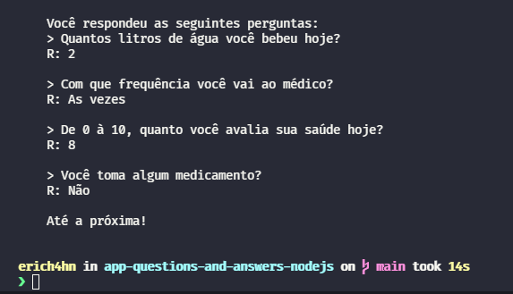

# ❤‍🩹 App Perguntas Sobre Saúde (App Questions About Health) 👨‍⚕

---

  

💬 Essa é uma aplicação que realiza perguntas sobre a saúde do usuário ao ser executado no terminal do NodeJS.

(💬 This is an application that asks user health questions when running on the NodeJS terminal.)

📢 **Obs:** Essa aplicação não armazena nenhuma informação sobre o usuário na nuvem. Sendo assim, quando o processo é encerrado, as respostas são excluídas.

(This application does not store any user information in the cloud. Therefore, when the process is closed, the responses are deleted.)

## 📜 Como Instalar e Usar (How To Install and Use)

---

A instalação da aplicação é muito simples, basta clonar o repositório para a sua máquina com o comando:

(Installing the application is very simple, just clone the repository to your machine with the command:)

`git clone https://github.com/erich4hn/app-about-health.git`

Assim que tiver clonado o repositório, basta executar o arquivo index com o node da seguinte forma:

(Once you've cloned the repository, just run the index file with the node as follows:)

`node index.js`

## ⛔ Requisitos Para Rodar o Sistema (Requirements to Run the System)

---

- NodeJS
- NPM

## 📑 Licença (License)

---

O projeto usa licença MIT. Veja a licença [AQUI](https://github.com/erich4hn/app-about-health/blob/master/LICENSE)

(This project use MIT License. See the license [HERE](https://github.com/erich4hn/app-about-health/blob/master/LICENSE))
